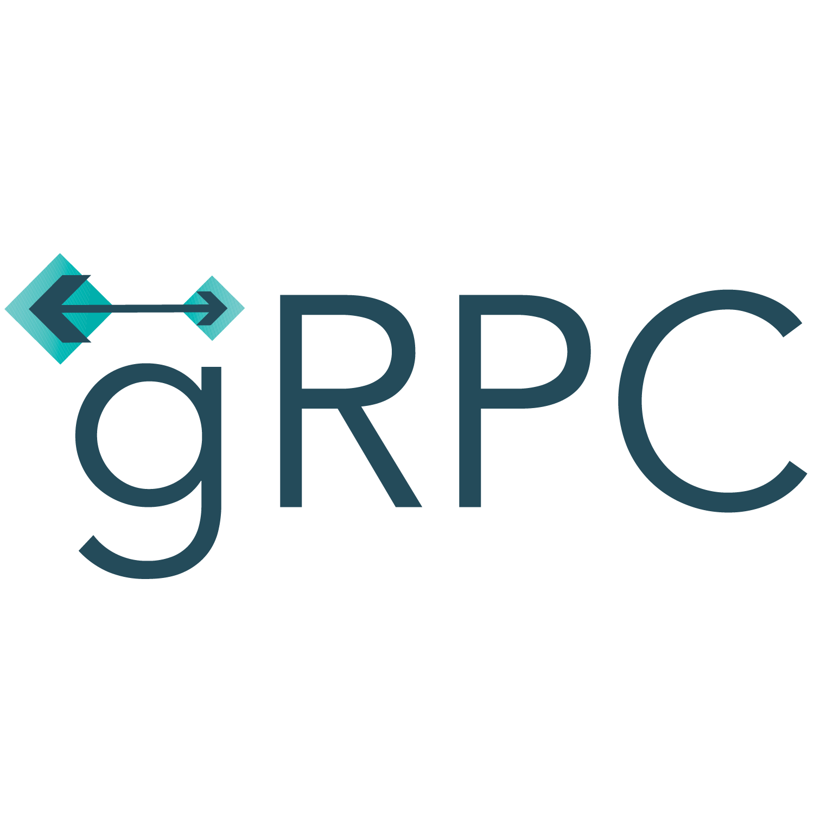

### Hey there! 👋

I am **Aditya**,

I am a technology enthusiast & a budding Software Engineer from India.

#### Technologies I work with:

  

      
  

  

    
  

  

    
  

    
  

    
  
  

      
  

  

      
  

  

      
  

  

      
  

  

    
  

  

      
  

  

      
  

  

    
  

  

      
  

  

    
  

### 🌐 Get In Touch with Me:

**Connect with me on LinkedIn [💬](https://www.linkedin.com/in/adityanagare)** 
**Send me an Email [📫](mailto:nagareaditya777@gmail.com)** 